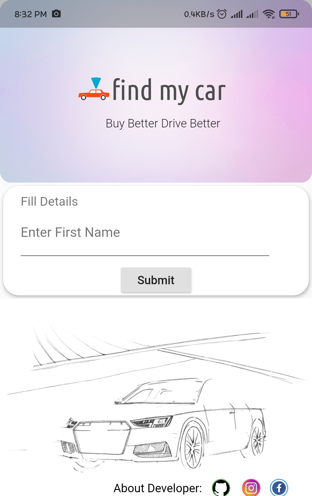
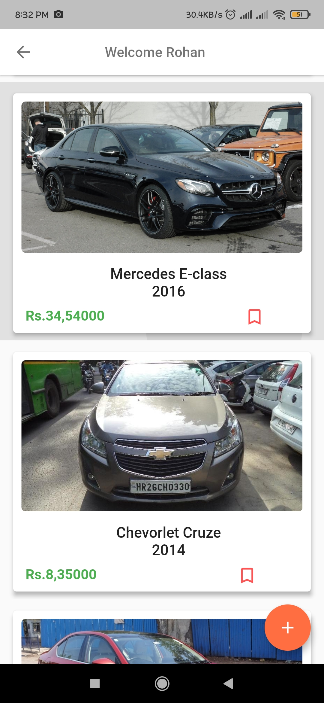
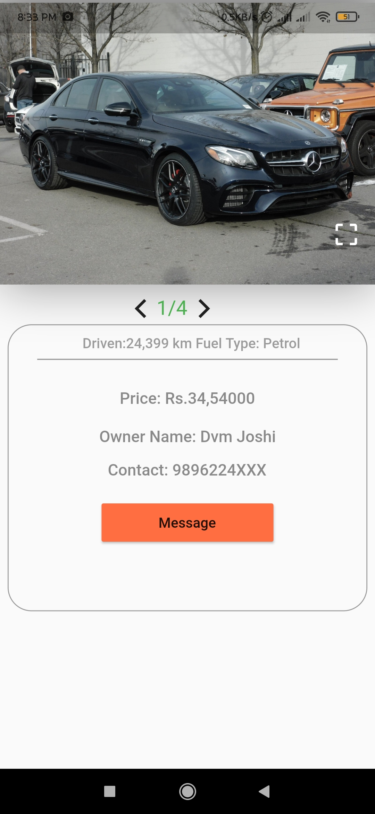

# Car-Bazaar
<h3>FLUTTER MOBILE APPLICATION<h3>
<h4>📌 Developed a Cross-platform application using Flutter that helps user to buy used cars.<h4>
<h4>📌 Used Google Firebase Connectivity as backend to store and extract data.</h4>
<h2>📱 First Screen</h2>  
 
<h2>📱 Dynamic Feed</h2>  

<h2>📱 Details Screen</h2>  

